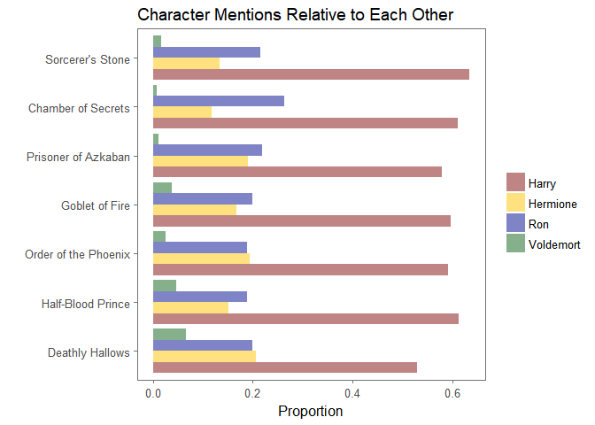

A Novice Analysis of the Words in Harry Potter
================
Evan Musick
January 30, 2018

Reading in the Text
-------------------

I found someone who has kindly provided access to the entire text of each Harry Potter book. The data can be accessed [here](https://github.com/bradleyboehmke/harrypotter). Each book is a character vector - one for each chapter.

``` r
library(harrypotter)
library(tidyverse)
library(tidytext)
library(stringr)
library(ggthemes)
library(knitr)

books <- list("Sorcerer's Stone" = philosophers_stone, "Chamber of Secrets" = chamber_of_secrets, 
              "Prisoner of Azkaban" = prisoner_of_azkaban, "Goblet of Fire" = goblet_of_fire, 
              "Order of the Phoenix" = order_of_the_phoenix, "Half-Blood Prince" = half_blood_prince,
              "Deathly Hallows" = deathly_hallows)

process_text <- function(book_title, books){
  book_text_raw <- tibble(books[[book_title]]) %>%
    select(text = 1) %>%
    mutate(chapter = row_number(),
           book = book_title) %>%
  unnest_tokens(word, text)
}

all_books_raw <- bind_rows(lapply(names(books), process_text, books)) %>%
  mutate(book = factor(book, levels = unique(book)))
```

This gives us one word per row with identifiers for the book and chapter.

    ## # A tibble: 1,089,386 x 3
    ##    chapter book             word   
    ##      <int> <fct>            <chr>  
    ##  1       1 Sorcerer's Stone the    
    ##  2       1 Sorcerer's Stone boy    
    ##  3       1 Sorcerer's Stone who    
    ##  4       1 Sorcerer's Stone lived  
    ##  5       1 Sorcerer's Stone mr     
    ##  6       1 Sorcerer's Stone and    
    ##  7       1 Sorcerer's Stone mrs    
    ##  8       1 Sorcerer's Stone dursley
    ##  9       1 Sorcerer's Stone of     
    ## 10       1 Sorcerer's Stone number 
    ## # ... with 1,089,376 more rows

Character Mentions
------------------

I've identified the 4 main characters as our characters of interest. Let's find out which book has the most (by percentage of words) mentions of each character.

``` r
characters_of_interest <- c("harry" = "Harry", "ron" = "Ron", "hermione" = "Hermione", "voldemort" = "Voldemort")

book_colors <- c("#7F0909", "#FFC500", "#0D6217", "#946B2D", "#000A90", "#000000", "#AAAAAA")

all_books_raw %>%
  count(book, word) %>%
  group_by(book) %>%
  mutate(freq_by_book = n/sum(n)) %>%
  filter(word %in% names(characters_of_interest)) %>%
  ggplot(aes(x = book, y = freq_by_book, fill = book)) + 
  geom_bar(stat = "identity", alpha = .5) +
  facet_grid(.~word,  scales = "free", labeller = as_labeller(characters_of_interest)) +
  scale_x_discrete(limits = rev(levels(all_books_raw$book))) + 
  scale_fill_manual(guide = FALSE, values = book_colors) +
  coord_flip() +
  labs(title = "Proportion of Character Mentions", x = "", y = "Proportion of All Words") +
  theme_few() +
  theme(strip.background = element_blank(),
        strip.text = element_text(size = 11),
        axis.text.x = element_text(size = 7, angle = 45, vjust = .75))
```


Now let's find out the popularity of each character within each book. For example, we can look at how many times Ron was mentioned compared to the total mentions of all 4 characters.

``` r
character_colors <- c("#7F0909", "#FFC500",  "#000A90","#0D6217")

all_books_raw %>%
  filter(word %in% names(characters_of_interest)) %>%
  count(book, word) %>%
  group_by(book) %>%
  mutate(char_freq_by_book = n/sum(n)) %>%
  ggplot(aes(x = book, y = char_freq_by_book, fill = word)) + 
  geom_bar(stat = "identity", alpha = .5, position = "dodge") +
  scale_fill_manual(values = character_colors, labels = c("Harry", "Hermione", "Ron", "Voldemort")) +
  scale_x_discrete(limits = rev(levels(all_books_raw$book))) + 
  coord_flip() +
  labs(title = "Character Mentions Relative to Each Other", x = "", 
       y = "Proportion", fill = "") +
  theme_few() +
  theme(strip.background = element_blank(),
        strip.text = element_text(size = 11))
```



tf-idf: What words are uniquely important to each book?
-------------------------------------------------------

``` r
all_books_tf_idf <- all_books_raw %>%
  anti_join(stop_words) %>%
  count(book, word) %>%
  bind_tf_idf(word, book, n) %>%
  group_by(book) %>%
  top_n(10, tf_idf) %>%
  ungroup() %>%
  arrange(book, tf_idf) %>%
  mutate(order = row_number())

# Need to reorder by tf-idf within each book

ggplot(all_books_tf_idf, aes(x = order, y = tf_idf, fill = book)) + 
  geom_col(show.legend = FALSE, alpha = .7) +
  scale_x_continuous(breaks = all_books_tf_idf$order, labels = all_books_tf_idf$word) +
  scale_fill_manual(values = book_colors) + 
  facet_wrap(~book, ncol = 3, scales = "free") +
  coord_flip() +
  labs(title = "Top 10 tf-idf Words in the Harry Potter Series", y = "") +
  theme_bw() +
  theme(strip.background = element_blank(),
        strip.text = element_text(size = 11),
        axis.text.y = element_text(size = 6))
```


